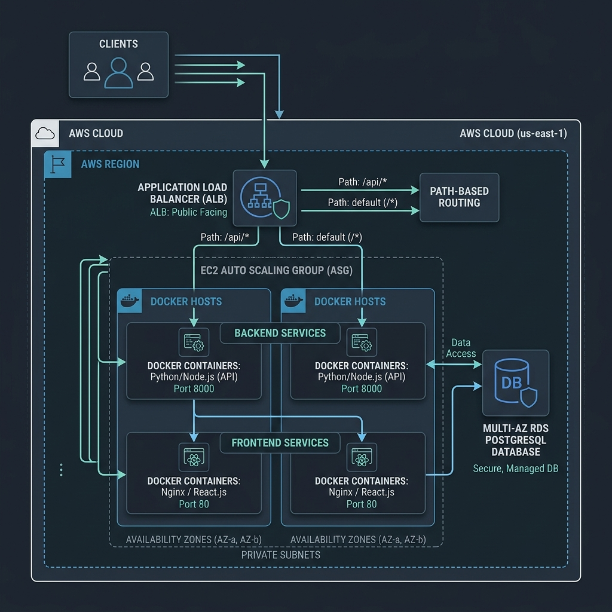

# 🏢 Enterprise Full-Stack AWS DevOps Platform

An enterprise-ready, production-grade DevOps template for containerized web applications on AWS. 

This platform manages a full-stack Employee Leave Management application (**React SPA + Node.js API**) powered by **AWS RDS PostgreSQL** and deployed on a **Single EC2 instance** serving traffic directly via **AWS Route 53 DNS**.

---

## 📐 Cloud Architecture

The system routes traffic directly to the EC2 container host via an A-record in AWS Route 53. The EC2 instance runs both the frontend and backend services using Docker Compose, with secure database storage isolated in AWS RDS PostgreSQL:



---

## 📁 Repository Structure

```text
root/
│
├── backend/                  # Express API Backend
│   ├── Dockerfile            # Multi-stage image build definitions
│   ├── app.js                # Express app entry (Sequelize Sync)
│   ├── package.json          # Dependencies (Sequelize, PG)
│   ├── config/               # Database connection configs (Sequelize objects)
│   ├── controllers/          # API logical handlers (Sequelize queries)
│   ├── middleware/           # JWT verification & role validation
│   ├── models/               # Sequelize PostgreSQL schemas
│   └── routes/               # Express routing definitions
│
├── frontend/                 # React Frontend Client
│   ├── Dockerfile            # Node build stage + Nginx static server
│   ├── nginx.conf            # Proxy routing for /api and React Router
│   ├── package.json          # Vite + React dependencies
│   ├── vite.config.js        # Dev proxy configs
│   ├── public/               
│   └── src/                  
│
├── infra/                    # Modular Infrastructure (Terraform)
│   ├── environments/         
│   │   ├── dev.tfvars        # Development environment variables
│   │   └── prod.tfvars       # Production environment variables
│   │
│   └── modules/              # Shared infrastructure components
│       ├── vpc/              # Isolated VPC, Subnets, Gateway setups
│       ├── rds/              # RDS PostgreSQL Instance
│       └── ecr/              # Docker Registry Repositories
│
├── docker-compose.yml        # Multi-container deployment configuration
└── .github/
    └── workflows/            # GitHub Actions CI/CD workflows
        ├── infra.yml         # Terraform pipeline (plan, apply, destroy)
        ├── build.yml         # Docker build, Trivy scan, and ECR push
        ├── deploy.yml        # Direct SSH deployment and container restart
        └── sonarqube.yml     # Code quality scanning via SonarCloud
```

---

## 🐳 Getting Started (Local Development)

### Prerequisites
- [Docker](https://www.docker.com/) and Docker Compose installed locally.

### 1. Run the Platform
Spin up the local PostgreSQL database, backend Express API, and frontend Nginx client:
```bash
docker compose up --build
```

### 2. Access Ports
- **Frontend SPA Client**: [http://localhost](http://localhost) (Port 80)
- **Backend API Server**: [http://localhost:8000](http://localhost:8000) (Check health status at [http://localhost:8000/health](http://localhost:8000/health))
- **PostgreSQL Database**: Port `5432`

---

## 🧪 Testing the Leave Approval Workflow (Locally)

Because the database starts fresh and empty, you must register the accounts and assign the manager role to test the approval dashboard:

1. **Register a Manager**: Navigate to [http://localhost](http://localhost), sign up, and select **`manager`** as your role.
2. **Register an Employee**: Sign up another user with the default **`employee`** role.
3. **Register an Admin**: Sign up a third user with the **`admin`** role.
4. **Assign the Manager**:
   - Log in as the **admin**.
   - Navigate to the **Admin Dashboard** tab in the header.
   - Click **Edit** next to the employee account and select the **manager account** from the dropdown menu to link them. Click Save.
5. **Raise a Leave Request**:
   - Log out and log back in as the **employee**.
   - Fill out and submit a new leave request (e.g. Annual Leave).
6. **Approve the Request**:
   - Log back in as the **manager**.
   - Go to your Manager Dashboard. The employee's request will appear in your pending reviews list, allowing you to **Approve** or **Reject** it.

---

## ☁️ Terraform Deployment (`infra/`)

### Setup Prerequisites (Bootstrap)
Terraform states are stored remotely to ensure team collaboration.
1. Configure your AWS credentials using GitHub Secrets (`AWS_ACCESS_KEY_ID`, `AWS_SECRET_ACCESS_KEY`).
2. Edit your target environment variable files (e.g., [`infra/environments/dev.tfvars`](infra/environments/dev.tfvars)) with the desired configurations.

### Initialize & Apply
You can run this manually from the environment subdirectory, or rely on the `infra.yml` GitHub Action:
```bash
# Initialize with dynamic backend values
terraform init -backend-config="backend_dev.hcl"

# Deploy Resources
terraform apply -var-file=environments/dev.tfvars
```

---

## 🛠️ CI/CD Pipelines (GitHub Actions)

Deployments are fully automated using GitHub Actions and authenticated via securely stored AWS Access Keys.

### 1. Infrastructure Pipeline (`infra.yml`)
- **Trigger**: Manual (`workflow_dispatch`).
- **Inputs**: Environment (`dev` or `prod`) and Action (`plan`, `apply`, or `destroy`).
- **Function**: Validates infrastructure configurations and builds or tears down the target environment automatically.

### 2. Build Pipeline (`build.yml`)
- **Trigger**: Manual (`workflow_dispatch`).
- **Security Check**: Initiates a **Trivy Container Scan**. Fails the pipeline if any `CRITICAL` vulnerability is discovered.
- **Function**: Builds, tags, and pushes frontend and backend images to AWS ECR.

### 3. Deploy Pipeline (`deploy.yml`)
- **Trigger**: Manual (`workflow_dispatch`).
- **Function**: Uses SCP to copy the `docker-compose.yml` to the EC2 host. Opens an SSH connection to the EC2 instance, pulls the latest code, authenticates with AWS ECR, and executes `docker compose pull && docker compose up -d` to seamlessly restart containers with the newly built images.

### 4. Code Quality Pipeline (`sonarqube.yml`)
- **Trigger**: Automatic on Pull Requests and manual dispatch.
- **Function**: Uploads code to **SonarCloud** for static code analysis, vulnerability scanning, and quality gate enforcement.
